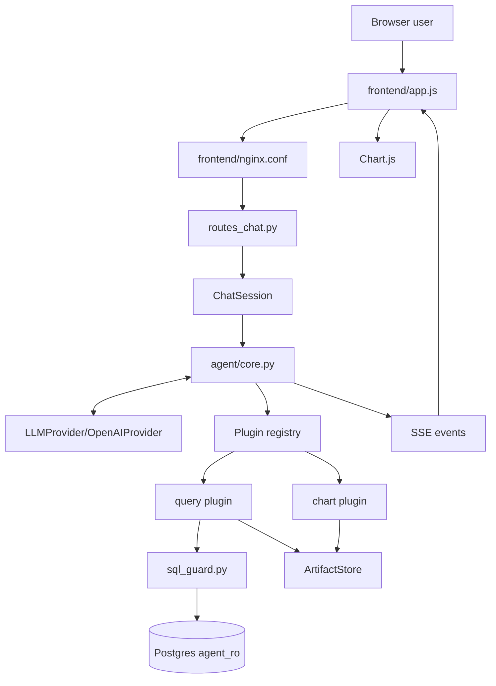

# Full Technical Interview Report

## Scope

This report describes the current implementation. It does not treat README claims as proof where source behavior says otherwise.

## End-to-end flow



1. `frontend/app.js` sends `POST /api/chat` with `session_id` and `message`.
2. `routes_chat.py` creates a UUID when no session exists, retrieves the in-memory `ChatSession`, and opens an SSE response.
3. `run_turn()` acquires the session lock and delegates to `_run_turn_locked()`.
4. The core appends the user message and derives tool schemas from the plugin registry.
5. `OpenAIProvider.stream()` converts internal messages and schemas into OpenAI requests.
6. Text deltas are streamed to the browser. Tool calls are accumulated and parsed.
7. The core validates arguments and executes the named plugin.
8. `query` validates and executes SQL through the `agent_ro` pool, normalizes rows, and stores a result reference.
9. `chart` resolves the result reference, builds a line/bar/scatter specification, and stores a chart reference.
10. Tool results are appended to history and sent back to the model.
11. The loop continues until text-only output, an error, or eight iterations.
12. The frontend renders the assistant response and Chart.js chart.

## API and interface layer

### `routes_chat.py`

Inputs are `ChatRequest(session_id, message)`. The route owns session lookup and SSE formatting, while the agent owns reasoning and tool execution. The route catches unexpected generator exceptions so raw tracebacks do not reach the stream.

The route does not provide authentication, authorization, rate limiting, request size limits, or session ownership. Provider error strings are already converted to an SSE error by the agent and can therefore reach the client.

### `routes_data.py`

The data routes use parameterized SQL through `data_access/queries.py`. Server and channel listing, daily activity, hourly distribution, and sample messages are deterministic API operations and do not require the LLM.

Negative `limit` and `offset` values are not rejected. Unknown server behavior is inconsistent: channels explicitly check existence, while daily/hourly endpoints can return an empty list.

### `routes_pins.py`

Pin creation validates and executes a query/chart plan before inserting it. Refresh retrieves the stored plan and replays it through the plugins. Delete removes the database row. Pin ownership does not exist because users are not modeled.

### `errors.py` and `logging_mw.py`

The application adds trace IDs to requests, logs structured JSON, and returns stable error envelopes for normal HTTP errors and unhandled exceptions. This is good operational structure, but streaming errors are handled separately and provider/database detail can still be exposed through those paths.

## Agent core

### `ChatSession`

`ChatSession` stores a mutable message list, a per-session `ArtifactStore`, and an `asyncio.Lock`. The lock protects same-session history from concurrent turns. It is process-local, so a restart or multi-worker deployment does not share state.

### `_run_turn_locked`

The function is deliberately thin. It owns:

- user-message insertion
- provider streaming
- token events
- tool-call recording
- plugin lookup
- argument parsing
- tool timeout
- structured tool errors
- retry counting
- final response detection
- iteration surrender

The model is allowed to call multiple tools in one provider response; the core executes them sequentially.

### Retry behavior

`retry_counts` is keyed by tool name and serialized arguments. The same exact call can exceed `MAX_RETRIES_PER_CALL`, after which the error is marked nonretryable. Different arguments receive a fresh count, so a model can consume the whole eight-iteration budget with variations of the same bad idea.

The `retryable` field is communicated to the model but is not an immediate control-flow gate. That is an important limitation to acknowledge.

### Exception behavior

The core catches `PluginError` and `asyncio.TimeoutError`. Unexpected plugin exceptions are not converted into structured tool results. They escape to the route-level handler and can leave the conversation history with an assistant tool call but no tool response.

## Provider layer

`LLMProvider` is an abstract interface. `OpenAIProvider` is the only implementation.

The adapter translates:

- internal `Message` objects to OpenAI messages
- plugin schemas to OpenAI function tools
- streamed text to `text_delta`
- streamed function fragments to accumulated `ToolCallRequest`
- provider exceptions to `error` events

The provider catches failures both around request creation and during stream iteration. There is no explicit application timeout or retry/backoff around the OpenAI request. Malformed JSON is converted to a synthetic invalid-argument object, which later normally becomes a Pydantic error.

## Plugin contract

`Plugin` requires:

- `name`
- `description`
- `input_model`
- asynchronous `execute(args, ctx)`

`parse_arguments()` uses Pydantic and converts validation failures into `PluginError`. `tool_schema()` derives the LLM schema from the same Pydantic model. `PluginContext` supplies the artifact store, database pool, and row cap.

`PluginResult` contains a `ResultRef`, display text, and optional progress events. `stream_progress()` exists for future long-running plugins but is unused by query and chart.

The interface provides extensibility, not security. A plugin has the context it receives, and there is no permission declaration or sandboxing mechanism.

## Plugin registry

`discover_plugins()` scans the plugin directory and imports modules. The scan itself does not inspect classes. Importing modules triggers `@register_plugin`, which instantiates classes and inserts them into `_REGISTRY` by name.

This is reasonable for one repository and one container because it provides a drop-in-file workflow without packaging setup. Entry points or a manifest would be better for separately installed or versioned plugin packages.

Potential failure: a broken plugin import can fail application startup. There is also no health state, versioning, lifecycle, or isolation between plugins.

## Query plugin

`QueryArgs` validates SQL and row cap. `QueryPlugin.execute()`:

1. Calls `validate_select()`.
2. Acquires a connection from the agent pool.
3. Executes the rewritten SQL.
4. Converts rows to dictionaries.
5. Converts dates, datetimes, decimals, and UUIDs to JSON-safe values.
6. Stores full rows in `ArtifactStore`.
7. Returns a 15-row preview and display text.

The query plugin does not assess whether SQL answers the user’s question correctly. It also does not estimate query cost. The database timeout and row cap are useful safeguards, but intermediate joins and sorting can still consume resources.

## SQL guard

`validate_select()` uses SQLGlot with the PostgreSQL dialect. It requires exactly one statement whose top-level node is `SELECT`. It walks the AST to reject DML and DDL nodes anywhere, rejects `SELECT INTO`, blocks selected dangerous functions, and rewrites the `LIMIT`.

This is substantially stronger than searching for words such as `DROP`. It is supported by database-level controls:

- `agent_ro` has `default_transaction_read_only = on`.
- `agent_ro` has a five-second statement timeout.
- `agent_ro` cannot read `pinned_charts`.
- The application adds a fifteen-second plugin timeout.

The guard is not a general query-cost governor, authorization layer, or semantic verifier. Negative limit behavior and unusual SQL constructs deserve targeted tests.

## Chart plugin

Chart arguments include reference ID, chart type, x field, y field, optional series field, aggregation, sorting, top-N, and title.

Line and bar charts group by x and optional series, then apply sum/average/count/min/max. Categories are capped at 200.

Scatter charts use a separate path and attempt to create raw numeric pairs. Nonnumeric points are skipped. Results over the cap are downsampled by series.

Known risks:

- mixed x-axis types can make category sorting fail;
- per-series rounding can potentially exceed the declared scatter cap;
- only the first row is used to validate column presence;
- malformed later rows can still cause downstream problems.

## Artifact design

A `ResultRef` has an ID, kind, row count, preview, and full data. The model sees `summary()`, not the full payload. Chart consumes a result reference and creates a new chart reference.

This design reduces context size and limits how much message content is re-read by the model. The cost is unbounded in-memory retention, process-local lifetime, and inability to recover artifacts after restart.

## Database and loading

The schema uses separate roles. `agent_ro` selects analytics tables only. `app_rw` reads analytics data and manages pins. The migration loader uses the owner connection, applies schema, and performs idempotent upserts.

The loader treats source timestamps as UTC and documents duplicate `(server_id, user_id)` collisions. Last-row-wins is deterministic but loses the earlier colliding profile.

The role passwords are fixed in schema and Compose files. This is acceptable for a local grading environment but not production secret management.

## Pins

`run_pin_spec()` creates a fresh artifact store, executes query, injects the new reference ID into chart arguments, and returns the chart specification. This bypasses the LLM and makes refresh deterministic.

The frontend’s pin tracking is weaker than the backend design: it records the most recent query and chart tool-call events, not a transactionally correlated successful pair. Multiple queries or failed calls can produce a mismatched pin.

## Frontend

The frontend uses a manual SSE reader because chat is a POST. It escapes assistant text before applying a restricted markdown-lite transformation. Images and links are stripped rather than rendered, which is defense in depth against hallucinated or injected markup.

The main frontend issue is server loading:

```js
select.innerHTML = servers.map(s =>
  `<option value="${s.server_id}">${s.server_name}</option>`
).join("");
```

Both values should be assigned through DOM APIs or escaped. Refresh/delete operations also do not consistently check HTTP failure responses.

## File-by-file summary

| File | Responsibility | Main concern |
|---|---|---|
| `app/main.py` | startup, middleware, routers, health | wildcard CORS; health detail leakage |
| `app/config.py` | environment settings | CORS setting is unused |
| `app/db.py` | asyncpg pools and JSON codec | no pool-level resource policy beyond size |
| `app/errors.py` | HTTP error envelopes | streaming/provider paths differ |
| `app/logging_mw.py` | trace IDs and JSON logs | caller-controlled trace ID is accepted |
| `agent/core.py` | agent loop and session locking | retryable flag not enforced; unbounded state |
| `agent/provider.py` | OpenAI adapter | no explicit provider timeout/retry |
| `agent/prompts.py` | schema/policy/date guidance | prompt rules are not hard security controls |
| `agent/sql_guard.py` | SQL AST validation | no semantic/cost guarantee |
| `plugins/base.py` | plugin contract and artifacts | flexible output and unbounded store |
| `plugins/registry.py` | discovery and registration | import-time global state |
| `plugins/query_plugin.py` | SQL execution and result refs | raw DB errors; semantic correctness absent |
| `plugins/chart_plugin.py` | chart transformation | mixed-type and cap edge cases |
| `pins.py` | deterministic replay | hardcoded plugin names |
| `api/routes_chat.py` | chat HTTP/SSE | no auth or rate limiting |
| `api/routes_data.py` | deterministic data APIs | negative pagination not validated |
| `api/routes_pins.py` | pin CRUD | no user ownership; Python scan on refresh |
| `data_access/queries.py` | parameterized app SQL | limited query error classification |
| `models/schemas.py` | request/response models | missing string length constraints |
| `scripts/schema.sql` | tables, indexes, roles | hardcoded role credentials |
| `scripts/load_data.py` | idempotent CSV loading | documented data loss on collisions |
| `frontend/app.js` | browser state, SSE, charts | unescaped server option HTML |
| `frontend/nginx.conf` | static serving and proxy | proxy is local deployment boundary only |
| `docker-compose.yml` | service orchestration | exposed ports and fixed role passwords |
| `tests/fakes.py` | scripted provider | no actual test cases |

## Major trade-offs

- The plugin registry favors local simplicity over package-level extensibility.
- In-memory sessions favor speed over restart recovery and horizontal scaling.
- Replayable pins favor durability over snapshot consistency.
- Handwritten SQL favors transparency over abstraction.
- Prompt instructions favor implementation speed over structural model isolation.
- SSE favors simple HTTP deployment over richer bidirectional protocols.
- A separate chart plugin favors composability over fewer model decisions.

## One-day priorities

1. Authentication, authorization, and user-scoped pins/sessions.
2. Request limits, rate limiting, and per-session cost budgets.
3. Session/artifact expiry and bounded memory.
4. Robust exception classification and provider timeouts.
5. Fix pin correlation, frontend escaping, and pagination validation.
